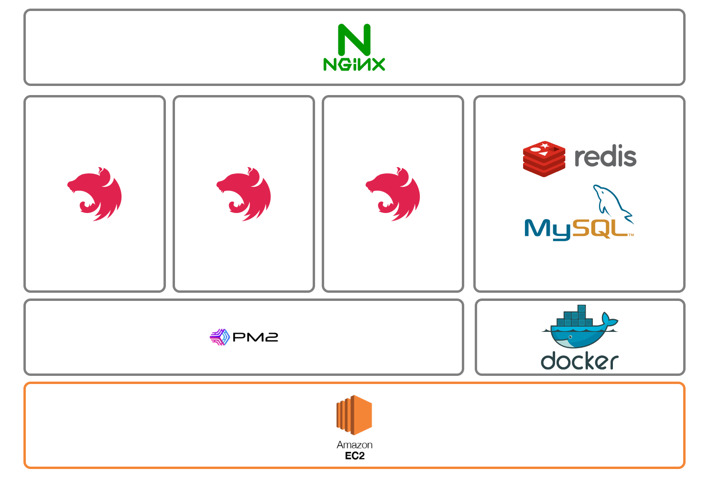
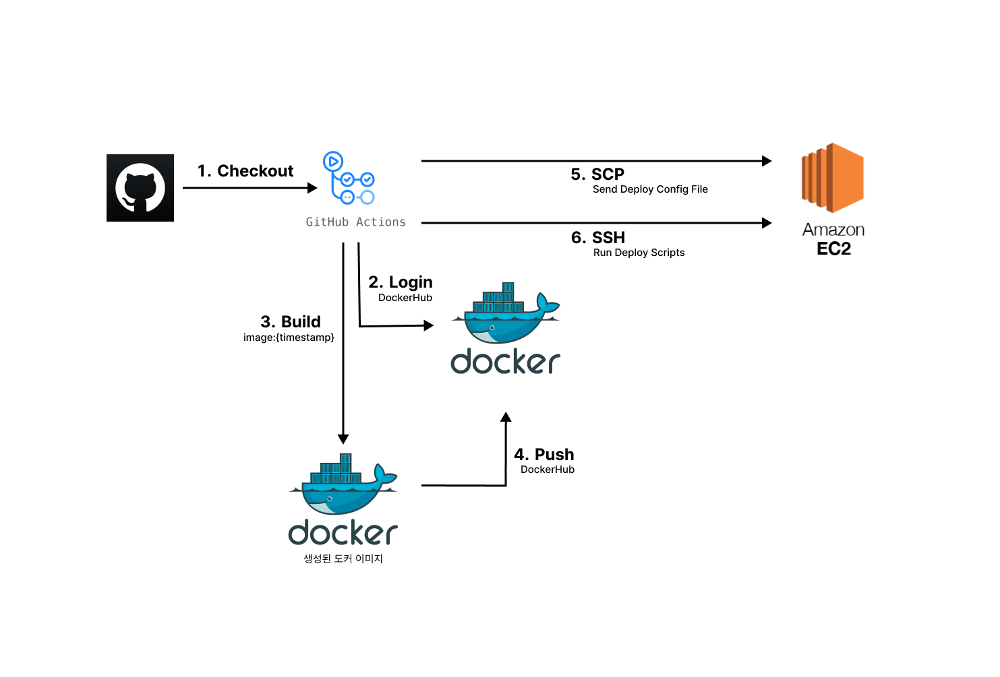

# Docker-compose, Nginx와 함께하는 무중단 배포
Github Action 기반 지속가능한 무중단 배포 자동화

## 개요
사내에서 MVP 프로젝트 배포시 api 서버의 경우, `EC2` 인스턴스에 레포를 pull 받고 빌드하여 `pm2`와 `Nginx`를 인스턴스 환경에 직접 설치하여 `pm2`로 api 프로세스를 실행시켜 무중단 상태를 유지시키며 배포하는 방식을 사용하고 있었다.

기존 배포 방식의 api 서버 내부 프로세스 모식도이다.

### 문제점
기존 배포 방식에서도 `Github Action`을 사용해서 CI/CD를 `SSH`로 대상 `EC2` 인스턴스에 접근하여 배포 스크립트를 실행시키는 방식으로 구현했었다. 하지만 해당 방식의 경우, 간혹 `EC2` 인스턴스의 메모리 부족 문제로 인해 pull 이후 빌드 단계에서 인스턴스가 멈춰버리는 이슈가 있어 무중단 자동 배포의 안정성이 떨어지는 단점이 있었다. 기존 배포 자동화 방식이 서버 배포시 안정성이 떨어지는 문제를 해결하고자 Docker 컨테이너 기반 배포 방식으로의 변경을 고려하게 되었다.

## Github-Action 흐름도

1. Github 레포에 PR이 머지되면 GithubAction 트리거에 걸려 GithubAction이 실행되고, actions/Checkout을 통해 해당 레포를 Clone한다.
2. Github 레포에 미리 세팅해둔 Secrets를 사용하여 Docker Hub에 로그인한다.
3. Github Action에서 `{프로젝트명}-api/{현재 빌드 시각 timestamp}`를 태그로 `no-cache` 옵션을 포함하여 Docker Image를 빌드한다.
4. 3단계에서 빌드가 완료된 이미지를 2단계에서 로그인해두었던 DockerHub에 Push한다.
5. AWS EC2에 `scp` 로 배포 관련 설정 파일들을 전송한다.
6. AWS EC2에 `ssh`로 접근하여 새로운 이미지가 포함된 `docker-compose.yml`을 실행시킨다.
	1. `docker-compose.yml`에는 `Nginx`, `api` 총 2개의 컨테이너가 존재한다.
7.  기존에 떠있던 api 컨테이너를 종료하지 않은 채 새로 Push 되어있는 이미지를 DockerHub에서 Pull 받아 신규 api 컨테이너를 `api-2` 와 같은 명칭으로 가동시킨 후, `롤링` 방식으로 `v1`/`v2`를  전환하며 별 이슈가 없을 시, 기존 api 컨테이너를 내리고 Nginx 컨테이너 설정을 reload하여 신규 배포된 api 컨테이너로 라우팅되도록 변경사항을 적용한다.
